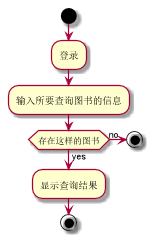

# 实验2：图书管理系统用例建模
<table>
<tr>
<td>学号</td>
<td>班级</td>
<td>姓名</td>
<td>照片</td>
</tr>
<tr>
<td>201510414429</td>
<td>15软件4班</td>
<td>周柏龄</td>
<td>暂无</td>
</tr>
</table>

## 1. 图书管理系统的用例关系图

### 1.1 用例图PlantUML源码如下：

``` usecase
@startuml
left to right direction
skinparam packageStyle rectangle
actor 图书管理员
actor 读者
actor 超级管理员
rectangle {
  图书管理员 --> (借出图书)
  图书管理员 -->(归还图书)
  图书管理员 --> (维护书目)
  图书管理员 --> (维护读者信息)
  (查询书目)<-- 读者
  (查询借阅情况)<-- 读者
  (预定图书)<-- 读者
  (维护书目) .> (查询书目) : include
  (预定图书) .> (取消预定) : extends
  超级管理员 --|> 图书管理员
  超级管理员 --> (维护图书管理员信息)
}
@enduml
```


### 1.2. 用例图如下：


## 2. 参与者说明：

###     2.1 图书管理员

主要职责是：借出图书 、归还图书 、维护书目 、维护读者信息

###     2.2 读者

主要职责是：查询书目、查询借阅情况、预定图书、取消预定

###     2.3 其他类型用户
    
主要职责是：维护图书管理员信息

##     3. 用例规约表

### 3.1 "查询书目"用例

|||
|:-------|:-------------|
|用例名称|查询书目|
|参与者|超级管理员、图书管理员、读者|
|前置条件|超级管理员、图书管理员或读者登录到系统|
|后置条件|产生并保存查询记录|
|主事件流|
|参与者动作|系统行为|
|1.超级管理员、图书管理员或读者跳转到系统查询书目页面；<br>2.超级管理员、图书管理员或读者输入图书的相关信息；|<br><br><br>3.系统列出所查询的书目的相关信息；<br>4.系统保存相关的查询记录，用例结束；|
|备选事件流|
|1a.没有所查询的书籍<br>&nbsp;&nbsp;&nbsp;&nbsp;1.系统提示没有相关书籍|
|业务规则|
|1.每次可查询到的信息为书籍的名称、库存量、作者、封面、内容等信息<br>2.用户可通过输入书名、内容、作者进行查询<br>3.登录后才可以进行查询操作|
<br>

**“查询书目”用例流程图源码如下：**
```
@startuml
start
:登录;
:输入所要查询图书的信息;
if (存在这样的图书) then (no)
stop
else (yes)
:显示查询结果;
endif
stop
@enduml
```
<br>

**“查询书目”用例流程图如下：**
<br>


### 3.2"维护书目"用例

|||
|:-------|:-------------|
|用例名称|维护书目|
|参与者|超级管理员、图书管理员|
|前置条件|超级管理员、图书管理员登录到系统|
|后置条件|产生并保存图书的维护记录|
|主事件流|
|参与者动作|系统行为|
|1.超级管理员或图书管理员跳转到系统维护书目信息页面；<br>2.超级管理员或图书管理员选择相关操作--查询图书、删除图书、修改图书信息、增加图书信息；|<br><br><br>3.系统保存相关的图书维护记录，给出相应的提示，用例结束|
|备选事件流|
|1a.查询没有相关书籍<br>&nbsp;&nbsp;&nbsp;&nbsp;1.系统提示查询没有相关书籍<br>2a.增加存在的书目<br>&nbsp;&nbsp;&nbsp;&nbsp;1.系统提示书籍已存在<br>3a.删除不存在书目<br>&nbsp;&nbsp;&nbsp;&nbsp;1.系统提示书籍不存在<br>4a.修改信息将库存量设为0<br>&nbsp;&nbsp;&nbsp;&nbsp;1.系统提示书籍库存量不能为0|
|业务规则|
|1.每次可查询到的信息为书籍的名称、库存量、作者、封面、内容等信息<br>2.用户可通过输入书名、内容、作者进行查询<br>3.不能修改书目编号<br>4.每个操作都只有在登录账户才能执行|
<br>

**“维护书目”用例流程图源码如下：**
```
@startuml
start
:登录;
:跳转到系统维护书目信息页面;
if (点击查询书目按钮) then (是)
:查询书目;
 elseif (点击删除书目按钮) then (是)
:删除书目;
 elseif (点击修改书目信息按钮 ) then (是)
:修改书目信息;
else (no)
  :点击增加书目信息按钮;
  :增加书目信息;
endif
:保存操作记录;
stop
@enduml
```
<br>

**“维护书目”用例流程图如下：**
<br>


### 3.3"预定图书"用例

|||
|:-------|:-------------|
|用例名称|预定图书|
|参与者|读者|
|前置条件|读者登录到系统|
|后置条件|添加预定记录|
|主事件流|
|参与者动作|系统行为|
|1.读者跳转到系统预定操作的页面；<br>2.查询想要预定的书籍；<br><br>4.读者点击预定按钮；|<br><br><br>3.系统列出该读者所查询到的书目的信息；<br><br>5.系统保存预定记录，提示用户预定成功，用例结束；|
|备选事件流|
|1a.想要预定的书籍库存不足<br>&nbsp;&nbsp;&nbsp;&nbsp;1.系统提示相关书籍库存不足|
|业务规则|
|1.每个读者可预定的书目数量不超过10本|
<br>

**“预定图书”用例流程图源码如下：**
```
@startuml
start
:登录;
:跳转到预定图书页面;
:输入书名;
if (图书存在) then (no)
stop
else (yes)
:显示图书信息;
:点击预定按钮;
if (图书库存不足) then (yes)
:提示“图书库存不足”;
else (no)
:显示“预定成功”;
endif
stop
@enduml

```
<br>

**“预定图书”用例流程图如下：**
<br>


### 3.4"借出图书"用例

|||
|:-------|:-------------|
|用例名称|借出图书|
|参与者|超级管理员、图书管理员|
|前置条件|超级管理员、图书管理员登录到系统|
|后置条件|产生并保存借阅记录|
|主事件流|
|参与者动作|系统行为|
|1.超级管理员、图书管理员跳转到系统借阅图书页面；<br>2.超级管理员、图书管理员输入图书的编号；<br><br>4.超级管理员、图书管理员输入读者的信息，点击借阅按钮；|<br><br>3.系统显示读者所借阅的书目的相关信息；<br><br>5.系统保存相关的借阅记录，提示借阅成功，用例结束；|
|备选事件流|
|1a.没有相关书籍<br>&nbsp;&nbsp;&nbsp;&nbsp;1.系统提示没有相关书籍<br>2a.读者借阅书籍已经达到上限<br>&nbsp;&nbsp;&nbsp;&nbsp;1.系统提示读者借书已达上限，不能再借阅图书<br>3a.没有此读者<br>&nbsp;&nbsp;&nbsp;&nbsp;1.系统提示没有此读者|
|业务规则|
|1.读者总共可借阅20本书|
<br>

**“借出图书”用例流程图源码如下：**
```
@startuml
start
:登录;
:跳转到借阅图书页面;
:输入图书编号;
if (图书存在) then (no)
stop
else (yes)
:输入读者编号;
if (读者存在) then (no)
stop
else (yes)
:点击借阅按钮;
if (借书量超过规定阈值) then (yes)
:超过借阅规定量;
else (no)
:显示“借阅成功”;
endif
stop
@enduml

```
<br>

**“借出图书”用例流程图如下：**
<br>


### 3.5"归还图书"用例

|||
|:-------|:-------------|
|用例名称|归还图书|
|参与者|超级管理员、图书管理员|
|前置条件|超级管理员、图书管理员登录到系统|
|后置条件|产生并保存归还记录|
|主事件流|
|参与者动作|系统行为|
|1.超级管理员、图书管理员跳转到系统归还图书页面；<br>2.超级管理员、图书管理员输入图书的编号；<br>3.超级管理员、图书管理员输入读者的信息，点击归还按钮；|<br><br><br><br>4.系统保存相关的借阅记录，提示归还成功，用例结束；|
|备选事件流|
|1a.没有相关书籍<br>&nbsp;&nbsp;&nbsp;&nbsp;1.系统提示没有相关书籍<br>2a.图书超期<br>&nbsp;&nbsp;&nbsp;&nbsp;1.系统提示图书超期，并执行相应的处罚措施<br>3a.没有此读者<br>&nbsp;&nbsp;&nbsp;&nbsp;1.系统提示没有此读者|
|业务规则|
|1.读者所借书籍时间不超过20天，20天后自动计费|
<br>

**“归还图书”用例流程图源码如下：**
```
@startuml
start
:登录;
:跳转到归还图书页面;
:输入图书编号;
if (图书存在) then (no)
stop
else (yes)
:输入读者编号;
if (读者存在) then (no)
stop
else (yes)
:点击归还按钮;
if (借书时间超过规定期限) then (yes)
:实施相应处罚措施;
else (no)
:显示“归还成功”;
endif
stop
@enduml

```
<br>

**“归还图书”用例流程图如下：**
<br>


