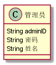

实验3：图书管理系统领域对象建模
======
| 学号 | 班级 | 姓名 |  |
| ---- | ---  | ---- | ---- |
| 201510414429 | 4班  |  周柏龄   |  |

1.图书管理系统类图
-----
### 1.1 类图PlantUML源码如下：
```
@startuml
class 预订书籍{
    +String  ISBN
    +String  预订人ID
    +Data  预订日期
}
class 借阅书籍{
    +String  ISBN
    +String  借阅者ID
    +Data  借书时间
    +Data  还书时间
}

class 借阅者{
    +String  ID
    +String  密码
    +String  姓名
    +String  性别
}

class 书籍信息{
    +String  ISBN
    +String 书名
    +Number 总数
    +String 作者
    +Date 出版日期
    +String 描述
    +int 库存
    +int 价格
    +List<String> 分类
}
class 管理员{
    String adminID
    String 密码
    String 姓名
}


借阅者"1" -- "N"预订书籍:预订、取消预订
借阅者"1" -- "N"借阅书籍:借阅、归还书籍
预订书籍 ..> 书籍信息
借阅书籍 ..> 书籍信息
书籍信息"N" -- "1"管理员:维护书籍信息
@enduml
```
### 1.2 类图如下：


### 1.3类图说明
总共有5个类，分别是借阅者类、预订书籍类、借阅书籍类、书籍信息类、管理员类，类与类之间的关系如下：<br>
1.借阅者与预订书籍之间的一对多（1-N）的关系，即一个借阅者可以预订多本书籍<br>
2.借阅者与借阅书籍之间的一对多（1-N）的关系，即一个借阅者可以借阅多本书籍<br>
3.预订书籍和书籍信息之间存在依赖关系，即预订书籍依赖与书籍信息<br>
4.借阅书籍与书籍信息之间存在依赖关系，即借阅书籍依赖与书籍信息<br>
5.管理员与书籍信息之间是一对多（1-N）的关系，即一个管理员可以维护多本书籍<br>

2.图书管理系统的对象图
---
### 2.1 预订书籍类
```
class 预订书籍{
    +String  ISBN
    +String  预订人ID
    +Data  预订日期
}
```


### 2.2 借阅书籍类
```
class 借阅书籍{
    +String  ISBN
    +String  借阅者ID
    +Data  借书时间
    +Data  还书时间
}
```


### 2.3 书籍信息类
```
class 书籍信息{
    +String  ISBN
    +String 书名
    +Number 总数
    +String 作者
    +Date 出版日期
    +String 描述
    +int 库存
    +int 价格
    +List<String> 分类
}
```


### 2.4 借阅者类
```
class 借阅者{
    +String  ID
    +String  密码
    +String  姓名
    +String  性别
}
```


### 2.5 管理员类
```
class 管理员{
    String adminID
    String 密码
    String 姓名
}
```

