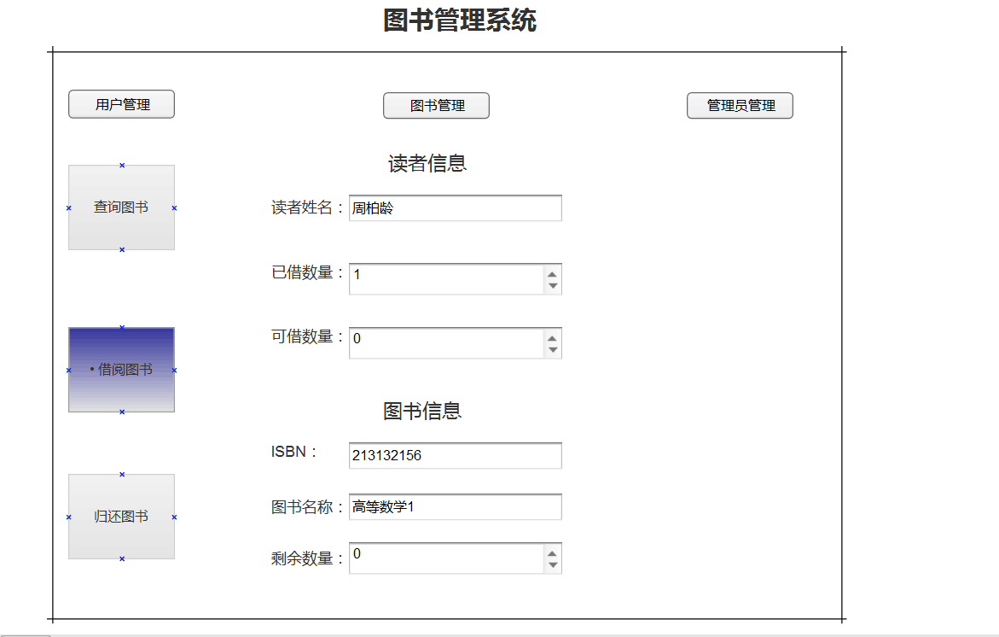

# 实验5：图书管理系统数据库设计与界面设计
|学号|班级|姓名|
|:-------:|:-------------: | :----------:|
|201510414429|软件(本)15-4|周柏龄|

## 1.数据库表设计

## 1.1 预借信息表
|字段|类型|主键，外键|可以为空|默认值|约束|说明|
|:-------:|:-------------:|:------:|:----:|:---:|:----:|:-----|
|id|varchar(50)|主键|否| | |预借记录主键，标记唯一记录|
|ISBN|varchar(50)| 外键 |否|||预借书号，与图书信息表主键关联|
|number|int| |否|||予借阅数量|
|date|date| |否|||预借时间|

## 1.2 借阅信息表
|字段|类型|主键，外键|可以为空|默认值|约束|说明|
|:-------:|:-------------:|:------:|:----:|:---:|:----:|:-----|
|id|varchar(50)|主键 |否|||借阅信息表主键，标记唯一借阅记录|
|ISBN|varchar(50)|外键|否|||关联图书信息表的主键|
|readerId|varchar(50)|外键|否|||关联借阅者表主键|
|isOvertime|short| |否||（0未超时/1超时）|借阅是否超时|
|lendDate|Datetime| |否|||借阅时间|
|returnDate|Datetime| |否|||归还时间|


## 1.3. 借阅者表
|字段|类型|主键，外键|可以为空|默认值|约束|说明|
|:-------:|:-------------:|:------:|:----:|:---:|:----:|:-----|
|ID|varchar(50)|主键|否|||主键，记录唯一标记|
|name|varchar(50)| |否|||读者姓名|
|sex|tinyint| |否||（0女/1男）|性别|
|role|int|外键 |否|||用户角色|
|maxBorrowNum|int| |否|||最大借阅量|
|maxBorrowDays|int| |否|||最大借阅天数|
|borrowNum|int| |是|||已借量|


## 1.4 图书信息表
|字段|类型|主键，外键|可以为空|默认值|约束|说明|
|:-------:|:-------------:|:------:|:----:|:---:|:----:|:-----|
|ISBN|varchar(50)|主键|否|||书号|
|bookDes|int|外键|否|||关联图书描述表|
|status|tinyint||否||（0已借出/1未借出/2被预借）|图书状态|

## 1.5 图书描述表
|字段|类型|主键，外键|可以为空|默认值|约束|说明|
|:-------:|:-------------:|:------:|:----:|:---:|:----:|:-----|
|id|varchar(50)|主键|否||||
|ISBN|varchar(50)|外键|否|||关联图书信息表主键|
|bookName|varchar(50)| |否|||书名|
|bookType|varchar(50)| |否|||类型|
|describe|varchar(200)| |否|||描述|
|price|double| |否|||价格|
|author|varchar(50)| |否|||作者|


## 1.6 管理员信息表
|字段|类型|主键，外键|可以为空|默认值|约束|说明|
|:-------:|:-------------:|:------:|:----:|:---:|:----:|:-----|
|adminId|varchar(50)|主键|否||||
|name|varchar(50)| |否|||系统登录账号|
|password|varchar(50)| |否|||密码|
|accessLevel|varchar(50)| |否|||权限级别|


***

## 2. 界面设计
## 2.1. 借书界面设计


- 用例图参见：借书用例
- 类图参见：借书类，读者类
- 顺序图参见：借书顺序图
- API接口如下：

1. 借阅者API

- 功能：获取用户基本信息
- 请求地址： http://zbllibrary.cn/v1/api/lender
- 请求方法：GET
- 请求参数：

|参数名称|必填|说明|
|:-------:|:-------------: | :----------:|
|ID|是|借阅者的uid|
|access_roken|是|用于验证请求合法性的认证信息。 |
|method|是|固定为 “GET”。|

- 返回示例：
```
{
  "code": 200，
  "message":"说明信息",
  "data":{
            "uid": "201510414126",
            "nickname": "周柏龄",
			"brrowNum":4,
			"maxBrrowNum":6,
			"maxBorrowDays":30,
			"lastBrrowTime":"2018-5-8"
        }
}
```
- 返回参数说明：

|参数名称|说明|
|:-------:|:-------------: |
|code|返回状态码|
|message|说明消息|
|data|返回的数据：用户预览信息|

2. 借阅API
- 功能：用于验证借阅者id是否存在
- 请求地址： http://library/v1/api/lend
- 请求方法：POST
- 请求参数：

|参数名称|必填|说明|
|:-------:|:-------------: | :----------:|
|access_token|是|用于验证请求合法性的认证信息。 |
|ISBN|是|借阅书籍书号 |

|method|是|固定为 “GET”。|

- 返回实例：
```
{
    "code":200,
    "message":"借阅成功"
}
```
- 返回参数说明：

|参数名称|说明|
|:-------:|:-------------: |
|code|状态码|
|message|提示信息|


